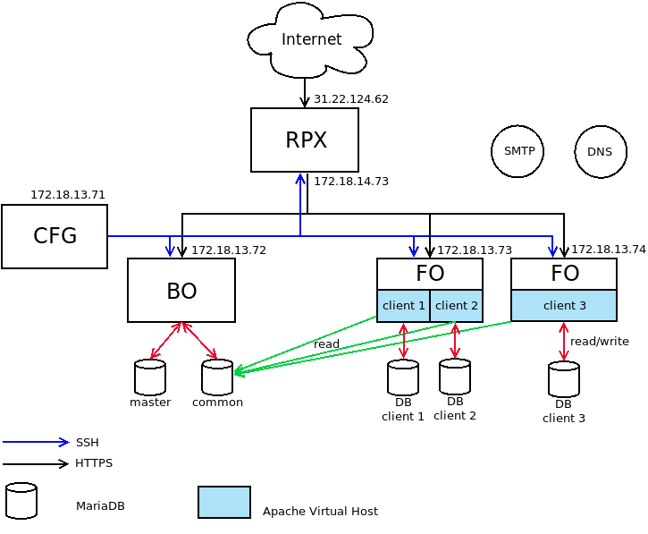

# Ansible playbook for MONARC deployement

This playbook is used to deploy the whole MONARC architecture in accordance to
the figure below.




## Requirements

* install git on all servers
* install Python 2 on all servers. Actually ansible 2.2 features only a tech
  preview of Python 3 support;
* install dnspython using pip install
* [ansible](https://www.ansible.com/) must be installed on the configuration
  server. We have tested with version 2.2.1.0 of ansible.
* install postfix on all BO and FO servers.


## Usage


Install ansible on the configuration server and get the playbook for MONARC:

    $ sudo apt-get install ansible
    $ git clone https://github.com/monarc-project/ansible-ubuntu.git
    $ cd ansible-ubuntu/

### Configuration

* create a user named *ansible* on each server;
* add the IP of the BO, FO and RPX in the file */etc/hosts* of the
  configuration server;
* generate a SSH key for the user *ansible* on the configuration server:

        $ ssh-keygen -t rsa -C "your_email@example.com"

* from the configuration server: ``ssh-copy-id ansible@BO/FO/RPX``
* add the user *ansible* in the *sudo* group:
  * ``sudo usermod -aG sudo ansible``
* add the user *www-data* in the *ansible* group:
  * ``sudo usermod -aG  ansible www-data``
* give the permission to ansible to use sudo without password:
  * add ``ansible  ALL=(ALL:ALL) NOPASSWD:ALL`` in the file */etc/sudoers*
* create a file _inventory/hosts_:

        [dev]
        FO

        [dev:vars]
        master= "BO"
        publicHost= "RPX.localhost"

        [master]
        BO monarc_sql_password="password"

        [rpx]
        RPX.localhost

        [monarc:children]
        rpx
        master
        dev

        [monarc:vars]
        env_prefix=""
        clientDomain= "RPX.localhost"
        github_auth_token="<your-github-auth-token>"
        protocol="https"
        certificate="sslcert.crt"
        certificatekey="sslcert.key"
        bourlalias="monarcbo"
        localDNS="example.net"

  The variable *monarc\_sql\_password* is the password for the SQL database
  on the BO.
* RPX needs the following apache modules enabled:
    ```bash
    a2enmod proxy
    a2enmod proxy_http
    a2enmod proxy_ajp
    a2enmod rewrite
    a2enmod deflate
    a2enmod headers
    a2enmod proxy_balancer
    a2enmod proxy_connect
    a2enmod proxy_html
    ```

* finally, launch ansible:

        $ cd playbook/
        $ ansible-playbook -i ../inventory/ monarc.yaml --user ansible

ansible will install and configure the back office, the front office and the
reverse proxy. Consequently the configuration server should be able to contact
these servers through SSH.

### Notes

1. Adding an attribute for the ansible inventory is done with the command:

        $ ssh ansible@BO sudo -u www-data /usr/local/bin/new_monarc_clients.sh | ./add_inventory.py ../inventory/
        $ ansible-playbook -i ../inventory/ monarc.yaml --user ansible

2. Removing an attribute for the ansible inventory is done with the command:

        $ ssh ansible@BO sudo -u www-data /usr/local/bin/del_monarc_clients.sh | ./del_inventory.py ../inventory/
        $ ansible-playbook -i ../inventory/ monarc.yaml --user ansible

   The command above should be launched on the configuration server with
   ``cron``.

3. Installation of Postfix on the BO and the FO is not done by ansible. You
   have to do it manually.

## Roles

There are three roles, described below.

### monarcco

Common tasks for the front and the back-office.

### monarcbo

[Backoffice](https://github.com/monarc-project/MonarcAppBO).
Only one per environment (dev, preprod, prod...).

### monarcfo

[Frontoffice](https://github.com/monarc-project/MonarcAppFO).
Can be multiple installation per environment to balance to the load.


## Python scripts

The `add_inventory.py` and `del_inventory.py` scripts are used to dynamically
edit the inventory files of the configuration server.

## SSL
Monarc is protected by SSL. The certificate ``yourcert.crt`` and the key file ``yourcert.key`` located at ``/etc/sslkeys/`` (location configurable using the variables in the ``inventory/hosts`` file) and can be read by all users (modified only by root). You can also use a single .pem file, but make sure it includes the certificate **and** the key.

It is, however, important to configure the apache2 correctly by adding the ssl module ``a2enmod ssl`` manually.

## RPX ApacheConfig

This configuration needs to be done manually for the moment and the file ``/etc/apache2/sites-enabled/000-default.conf`` should look like this:

```apache
<VirtualHost *:80>
        ServerName <your server name>
        Redirect permanent  / https://<your server name>
</VirtualHost>

<VirtualHost _default_:443>
        ServerName <your server name>

        ServerAdmin webmaster@<your server name>
        DocumentRoot /var/www/html

        SSLEngine on
        SSLCertificateFile "<your certificate>"
        SSLCertificateKeyFile "<your certificate key>"

        SSLProxyEngine On
        SSLProxyVerify none
        SSLProxyCheckPeerCN off
        SSLProxyCheckPeerName off
        SSLProxyCheckPeerExpire off
        Include "/etc/apache2/client_redirection"

        ErrorLog ${APACHE_LOG_DIR}/error.log
        CustomLog ${APACHE_LOG_DIR}/access.log combined

</VirtualHost>

```

